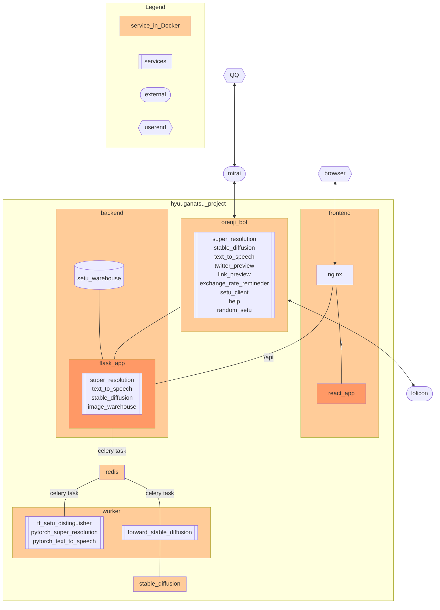

# Hyuuganatsu Project
Hi! This project is still under construction. You can visit [日向夏Web](http://sr-orenji.ml:6990/) to try the functionalities!

## What does the Hyuuganatsu Project do?
It's a comprehensive project to make it easy for anyone to play with AI functionalities. We currenty have web and QQ bot as user-end, and super-resolution, text-to-speech, stable-diffusion as behind-the-scene magic.

## Project structure
There will be 5 repos, where 2~5 are submodule of the first one.

1. `hyuuganatsu_project`: The top-level entrypoint for building and deploying.
2. `orenji_bot`: The QQ bot user interface.
3. `backend`: The web backend, handling requests from QQ bot.
4. `worker`: The worker for backend, who really casts spell (deep learning computation).
5. `stable_diffusion`: The standalone service who provides anime image generation.
6. `frontend`: The web frontend, written with React. Also holds the reversed proxy.

## Project diagram

<!--

**Here are some ideas to get you started:**

🙋‍♀️ A short introduction - what is your organization all about?
🌈 Contribution guidelines - how can the community get involved?
👩‍💻 Useful resources - where can the community find your docs? Is there anything else the community should know?
🍿 Fun facts - what does your team eat for breakfast?
🧙 Remember, you can do mighty things with the power of [Markdown](https://docs.github.com/github/writing-on-github/getting-started-with-writing-and-formatting-on-github/basic-writing-and-formatting-syntax)
-->
